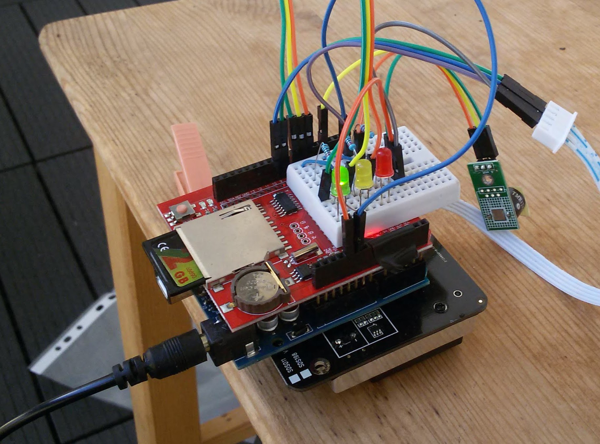

# Detector of cigarette smoke

Our neighbours smoke at the balcony and the smoke gets inside if we leave windows open. So I decided to build a smoking detector alarm based on PM values (only reasonable property of air I was able measure for this purpose). 
Current prototype is based on Arduino board (tests are mare with Arduino UNO + SDshield with RTC) and SDS011 PM detector (+LEDs and piezo buzzer)

## rules for detecting of smoking
* if PM2.5 is 5 higher than a minute ago - smoking detected, last good value is saved (average of 10 values 1 minute ago)
* one minute after smoking alarm starts we check if the PM2.5 value was exceeded by at elast 10 - otherwise we declare it a false alarm and reinitialize the array with current values
* end of smoking alarm: after 15 minutes we stop the smoking status (we assume smoking doesn't last longer than 15min, just the air got naturally bad somehow)
* end of smoking alarm: when the PM2.5 value is less than 5 over last_good for 30 seconds (PM values array is reinitialized to current PM value) - if this occured after less then 1 minute, we declare false alarm

## Parts
* SDS011 PM sensor - 17€
* Arduino UNO - 3€ (or NodeMCU)
* LEDs with resistors - 1€
* piezo buzzer - 1€
* SDlogger shield with RTC - 2€
* cables, power supply (or just USB cable)
* cover/box - something similar to [lufdaten.info sensor](https://luftdaten.info/en/construction-manual/) can be built
Prices are from Aliexpress. Total price of the prototype parts was around 25€. 
 
## Further work
* improve the algorithm
* add communication (like wifi with esp8266 for online logging) and response to alarm (like triggering other devices through NRF24L01)
* try PMS5003 PM detector (it's a more compact box)
 
For further investigation and algorithm improvemets: [Logged data](data)

